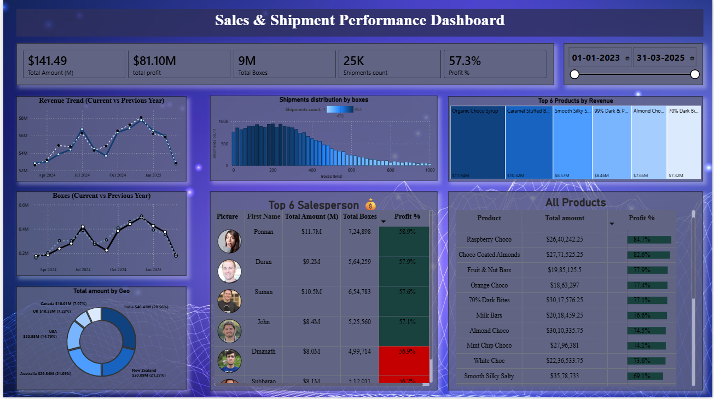

# Power BI Sales & Shipment Dashboard

## 📊 Overview
This project is a Power BI dashboard designed to analyze sales, shipments, and product performance.

It provides insights into revenue trends, shipment distribution, top-performing products, and profitability using interactive visuals and DAX calculations.

---

## 🚀 Key Features
- KPI cards showing total revenue, profit, shipments, and profit %
- Revenue trend analysis (Current Year vs Previous Year)
- Shipment distribution analysis using histogram
- Top 6 products by revenue (Treemap)
- Contribution % calculation using DAX
- Top 6 salesperson performance analysis
- Profit comparison across products

---

## 🛠️ Tools & Technologies
- Power BI  
- DAX (Data Analysis Expressions)

---

## 💡 Insights
- Top 6 products contribute a significant portion of total revenue  
- Majority of shipments fall in the range of 200–400 boxes  
- Profit margins vary significantly across products  
- Some products generate high revenue but lower profit  

---

## 📸 Dashboard Preview

---

## 📂 Files Included
- Dashboard Sample.pbix  
- PowerBI Dashboard.png  

---

## 👤 Author
Ayush Varma
